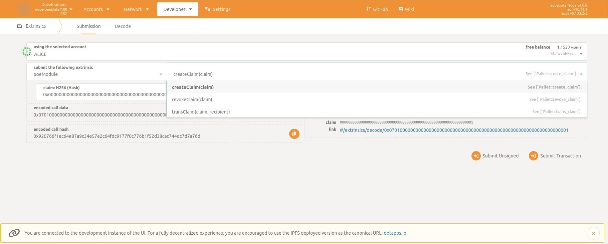
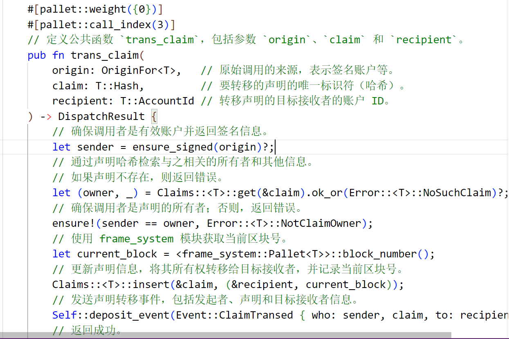

# Substrate 课程代码

## Substrate 课程代码_第三课
### 冒泡排序算法代码
[链接](bubble_sort)

## Substrate 课程代码_第四课
### 信号灯、求和、图形面积代码
1. [信号灯](/第四课作业/信号灯.rs)
2. [求和](/第四课作业/求和.rs)
3. [图形面积](/第四课作业/图形面积.rs)

## Substrate 课程代码_第五课
## Poe功能代码
[poe代码](/第五课作业/poe/src/lib.rs)

### 运行截图

### poe功能截图

### polkadot.js事件截图

### trans_claim代码截图

